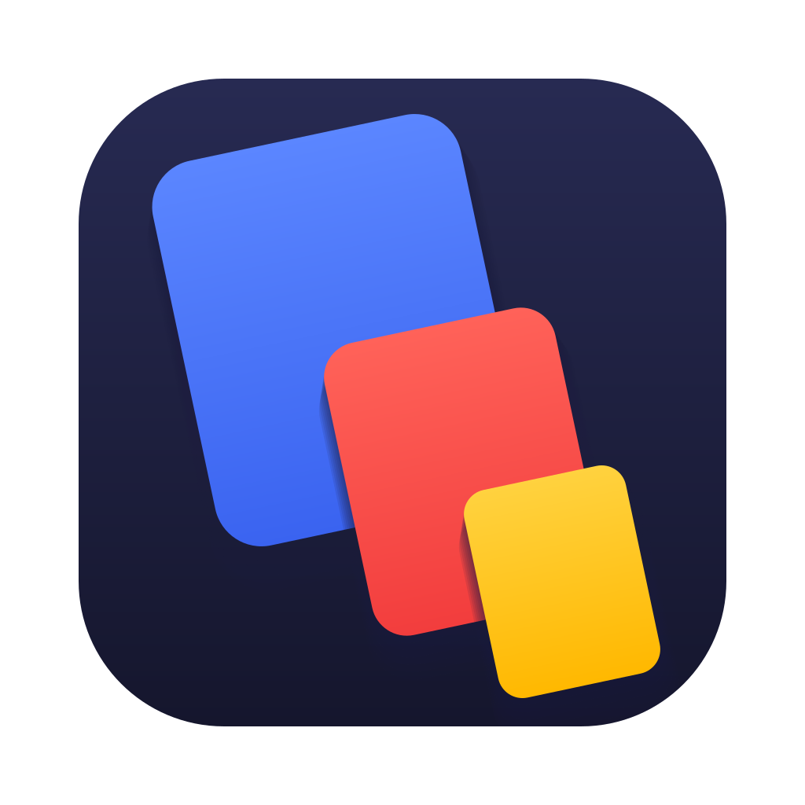
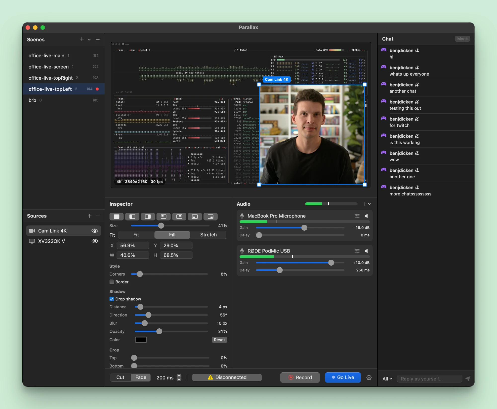

# Parallax

A macOS livestreaming studio in one app. It replaces an OBS + StreamYard + Loopback/Audio Hijack setup: capture, scenes, audio mixing, local recording, multistreaming, and unified chat.



## Features

- **Scenes and layouts**: cameras, displays, windows, images, and chat overlays. Drag, resize, snap, crop, round corners, and add shadows. Switch scenes with ⌘1–9 using a cut or fade.
- **Audio mixer**: any mic or interface plus system audio, with per-input gain, sync delay, high-pass, noise gate, and a master limiter.
- **Local recording**: H.264/HEVC up to 4K, crash-safe, independent of the stream.
- **Multistreaming**: upload one stream, and the server relays it to each platform (Twitch and YouTube today).
- **Unified chat**: read platform chat and reply from the app.

## How it works

```
 Mac (Parallax app)                            Server (parallax-server)
 ┌──────────────────────────────┐   1 upload   ┌────────────────────────────┐          ┌─ Twitch
 │ capture → compose → encode   │ ───────────▶ │ ingest → relay (no re-enc) │ ───────▶ ├─ YouTube
 │ local recording (full qual.) │     SRT      │                            │          └─ …
 │ scenes, mixer, chat          │ ◀─────────── │ platform sign-in + chat    │ ◀── platform chat APIs
 └──────────────────────────────┘  REST + WS   └────────────────────────────┘
```

The Mac composes and encodes the program once and sends it to the server over SRT. The server ([MediaMTX](https://mediamtx.org) + ffmpeg) relays it to every platform without re-encoding, so home upload bandwidth doesn't scale with the number of destinations. It also holds platform sign-ins and brings chat back to the app. Recording happens locally at full quality, so upload trouble never affects it.

More in [Architecture](docs/architecture.md) and the [client↔server protocol](docs/protocol.md).

## Status

| | What | Status |
|---|---|---|
| [`client/`](client/) | macOS app (Swift, SwiftUI, AVFoundation, ScreenCaptureKit, Core Image/Metal) | Capture, scenes, mixer, recording, Go Live, chat |
| [`server/`](server/) | Relay (Rust, MediaMTX, ffmpeg) | Twitch, YouTube; more platforms next |

## Quick start

Build and open the app:

```bash
client/scripts/build-app.sh debug --open
```

Run the tests:

```bash
client/scripts/test.sh
```

Requires macOS 15+ and either Xcode or the Command Line Tools (the scripts handle the CLT-only quirks, see `client/scripts/env.sh`).

## Streaming setup

1. Run `parallax-server`, on your Mac or your own host ([server setup](server/README.md#run-locally)).
2. Set up each platform you want to stream to. Each guide walks through the one-time account and app registration steps:
   - [Twitch setup](docs/setup/twitch.md)
   - [YouTube setup](docs/setup/youtube.md)
3. In the app, open **Settings › Server**, enter the server's URL and token, and connect your accounts.
